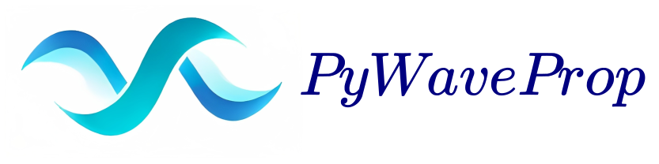

# PyWaveProp: wave propagation framework for Python 3

## Key features

* Modelling the radio wave propagation over irregular terrain, tropospheric duct and vegetation ([link](https://doi.org/10.1109/RTUWO.2018.8587886))
* Diffraction over the Earth's surface ([link](https://ieeexplore.ieee.org/abstract/document/8409980))
* Transparent boundaries modelling via the discrete nonlocal boundary conditions ([link](https://ieeexplore.ieee.org/abstract/document/8409980))
* Arbitrary operational frequency and transmitting antenna patterns ([link](https://doi.org/10.1109/ICUMT.2018.8631206))
* Automatic mesh generation ([link](https://doi.org/10.3390/jmse11030496))
* Automatic artificial parameters fitting: approximation method and order, propagation constant, nonlocal boundary condition parameters, backscattering parameters, maximum propagation angle  ([link](https://doi.org/10.1007/978-3-030-58799-4_22))
* Arbitrary output result grid
* Higher-order [discrete](https://doi.org/10.1007/978-3-031-10522-7_3) and semi-discrete propagator approximations: Padé approximation, [rational interpolation](https://doi.org/10.1016/j.jocs.2021.101536), [Numerov scheme](https://doi.org/10.1109/LAWP.2020.3026626), [differential evolution method](https://doi.org/10.1007/978-3-031-08751-6_15)
* Discrete dispersion relation analysis and its visualization
* Underwater acoustics: sound propagation over inhomogeneous sound speed profile and irregular bottom ([link](https://doi.org/10.3390/jmse11030496))
* Multiple knife-edge diffraction problem solver ([link](https://doi.org/10.1109/TAP.2019.2957085))
* Wavenumber integration method
* Python wrappers for [PETOOL](https://www.sciencedirect.com/science/article/pii/S0010465511002669) and [RAM](http://staff.washington.edu/dushaw/AcousticsCode/RamMatlabCode.html)
* Greene and Claerbout approximations with linear shift map method ([link](https://ieeexplore.ieee.org/abstract/document/8023886))
* Visualization of the wave fields

## Acknowledgements

The library is supported by the Russian Science Foundation grant number [21-71-00039](https://rscf.ru/en/project/21-71-00039/).

## Contacts

You are welcome to contact [Dr. Mikhail S. Lytaev](https://github.com/mikelytaev) with any questions, problems or proposals regarding the PyWaveProp.