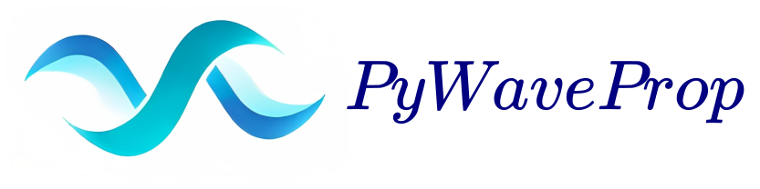

# PyWaveProp: wave propagation framework for Python 3

## Key features

* Modelling the radio wave propagation over irregular terrain, tropospheric duct and vegetation ([link](https://doi.org/10.1109/RTUWO.2018.8587886))
* Diffraction over the Earth's surface ([link](https://ieeexplore.ieee.org/abstract/document/8409980))
* Transparent boundaries modelling via the discrete nonlocal boundary conditions ([link](https://ieeexplore.ieee.org/abstract/document/8409980))
* Arbitrary operational frequency and transmitting antenna patterns ([link](https://doi.org/10.1109/ICUMT.2018.8631206))
* Automatic mesh generation ([link](https://doi.org/10.3390/jmse11030496))
* Automatic artificial parameters fitting: approximation method and order, propagation constant, nonlocal boundary condition parameters, backscattering parameters, maximum propagation angle  ([link](https://doi.org/10.1007/978-3-030-58799-4_22))
* Arbitrary output result grid
* Higher-order [discrete](https://doi.org/10.1007/978-3-031-10522-7_3) and semi-discrete propagator approximations: Padé approximation, [rational interpolation](https://doi.org/10.1016/j.jocs.2021.101536), [Numerov scheme](https://doi.org/10.1109/LAWP.2020.3026626), [differential evolution method](https://doi.org/10.1007/978-3-031-08751-6_15)
* Discrete dispersion relation analysis and its visualization
* Underwater acoustics: sound propagation over inhomogeneous sound speed profile and irregular bottom ([link](https://doi.org/10.3390/jmse11030496))
* Multiple knife-edge diffraction problem solver ([link](https://doi.org/10.1109/TAP.2019.2957085))
* Wavenumber integration method
* Python wrappers for [PETOOL](https://www.sciencedirect.com/science/article/pii/S0010465511002669) and [RAM](http://staff.washington.edu/dushaw/AcousticsCode/RamMatlabCode.html)
* Greene and Claerbout approximations with linear shift map method ([link](https://ieeexplore.ieee.org/abstract/document/8023886))
* Visualization of the wave fields
* Real-world environment data: terrain, land cover, bathymetry, Argo sound speed profiles, and NWP-derived tropospheric refractivity (`pywaveprop.environment`)

## Installation

```
pip install pywaveprop
```

Environment data loaders need extra dependencies:

```
pip install "pywaveprop[environment]"
```

## Environment data

`pywaveprop.environment` turns coordinates into ready-to-propagate media. For
the troposphere it builds a modified-refractivity cube `M(height, lat, lon)`
from NOAA GFS numerical weather prediction, splices in the Monin-Obukhov
evaporation duct that GFS cannot resolve, and hands the parabolic-equation
solver a range-dependent `M(x, z)`:

```python
from pywaveprop.environment import BBox, fetch_refractivity_cube, fetch_surface_bulk
from pywaveprop.environment.nwp import refractivity_transect_from_cube

bbox = BBox(48.0, 57.0, 23.0, 30.5)                 # Persian Gulf
cube = fetch_refractivity_cube(bbox, top_height_m=3000, dz_m=25)
bulk = fetch_surface_bulk(bbox)                     # SST, 2 m T/RH, 10 m wind
tr = refractivity_transect_from_cube(cube, (26.40, 51.90), (25.60, 53.10),
                                     bulk=bulk, z_top=1200.0)

env.M_profile = tr.M_profile()                      # rwp.environment.Troposphere
```

GFS comes from the NOMADS subsetter for recent cycles and from the AWS Open Data
archive (byte-range `.idx` subsetting) for older ones; downloads are cached
under `~/.cache/pywaveprop/`. `python -m pywaveprop.environment --bbox ... --out
cube.nc` does the same from the command line.

## Acknowledgements

The library is supported by the Russian Science Foundation grants [21-71-00039](https://rscf.ru/en/project/21-71-00039/)
and [23-71-01069](https://rscf.ru/en/project/23-71-01069/).

## Contacts

You are welcome to contact [Dr. Mikhail S. Lytaev](https://github.com/mikelytaev) with any questions, problems or proposals regarding the PyWaveProp.