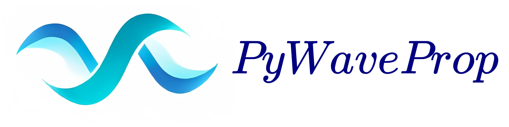

PyWaveProp
======================================================

.. toctree::
   :maxdepth: 2

   rwp
   uwa
   knife_edge
   about

Key features
============
* Modelling the radio wave propagation over irregular terrain, tropospheric duct and vegetation
* Diffraction over the Earth's surface
* Transparent boundaries modelling via the discrete nonlocal boundary conditions
* Arbitrary operational frequency and transmitting antenna patterns
* Automatic mesh generation
* Automatic artificial parameters fitting: approximation method and order, propagation constant, nonlocal boundary condition parameters, backscattering parameters, maximum propagation angle
* Arbitrary output result grid
* Higher-order discrete and semi-discrete propagator approximations: Padé approximation, rational interpolation, Numerov scheme, differential evolution method
* Discrete dispersion relation analysis
* Underwater acoustics: sound propagation over inhomogeneous sound speed profile and irregular bottom
* Multiple knife-edge diffraction problem solver
* Wavenumber integration method
* Python wrappers for PETOOL and RAM
* Greene and Claerbout approximations with linear shift map method
* Visualization of the wave fields

Acknowledgements
==================
The library is supported by the Russian Science Foundation grants `21-71-00039 <https://rscf.ru/en/project/21-71-00039/>`_ and
`23-71-01069 <https://rscf.ru/en/project/23-71-01069/>`_.

Indices and tables
==================

* :ref:`genindex`
* :ref:`modindex`
* :ref:`search`
