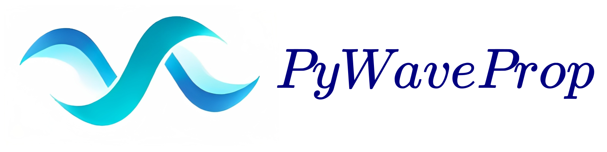

PyWaveProp
======================================================

.. toctree::
   :maxdepth: 2

   installation
   migration
   rwp
   uwa
   knife_edge
   apireference
   about

Key features
============
* **JAX-based computation** -- primary implementation uses JAX for GPU acceleration and automatic differentiation
* Modelling the radio wave propagation over irregular terrain, tropospheric duct and vegetation
* Diffraction over the Earth's surface
* Transparent boundaries modelling via the discrete nonlocal boundary conditions
* Arbitrary operational frequency and transmitting antenna patterns
* Automatic mesh generation
* Automatic artificial parameters fitting: approximation method and order, propagation constant, nonlocal boundary condition parameters, maximum propagation angle
* Arbitrary output result grid
* Higher-order discrete and semi-discrete propagator approximations: Pade approximation, rational interpolation, Numerov scheme
* Discrete dispersion relation analysis
* Underwater acoustics: sound propagation over inhomogeneous sound speed profile and irregular bottom
* Multiple knife-edge diffraction problem solver
* Wavenumber integration method
* Greene and Claerbout approximations with linear shift map method
* Visualization of the wave fields

What's new in 2.0
==================
Starting with version 2.0, PyWaveProp uses **JAX** as the primary computation backend.
The previous NumPy/Cython implementation is still available but is **deprecated** and will
be removed in a future release.

See :doc:`migration` for details on updating your code.

Acknowledgements
==================
The library is supported by the Russian Science Foundation grants `21-71-00039 <https://rscf.ru/en/project/21-71-00039/>`_ and
`23-71-01069 <https://rscf.ru/en/project/23-71-01069/>`_.

Indices and tables
==================

* :ref:`genindex`
* :ref:`modindex`
* :ref:`search`
